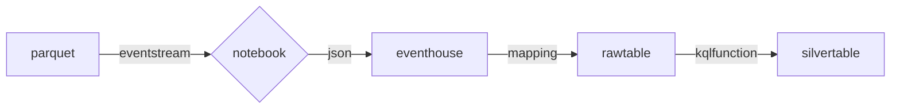

# Grouper
## Objective
- Doing timeseries analytics in Fabric.

### Main Points 
- ~~Getting Elasticsearch data into Fabric.~~
- Minimizing latency due to the hops of sensor > storage > elastic > app. 
- Addressing fragmented analytics due to wrong source choice and sparse data. 
- Doing Data Science over this data. 

## Flow

## Implementation steps
1. [Step 1](step1.md)
2. [Step 2](step2.md)
3. [Step 3](step3.md)
   
## Resources – Tools, Content & Data Science

- [Kafka to Eventstream](https://learn.microsoft.com/fabric/real-time-intelligence/event-streams/connect-connecots-in-virtual-network-on-premises)
- [Kafka to Eventhouse](https://learn.microsoft.com/azure/data-explorer/integrate-overview?tabs=connectors#apache-kafka)
- [Eventstreams - Azure Blob Storage events](https://learn.microsoft.com/fabric/real-time-intelligence/event-streams/add-source-azure-blob-storage)
- [Eventhouse Notebook](https://learn.microsoft.com/fabric/real-time-intelligence/notebooks)
- [Eventhouse json mapping](https://learn.microsoft.com/kusto/management/json-mapping?view=microsoft-fabric)
- [Eventhouse entity naming rules](https://learn.microsoft.com/kusto/query/schema-entities/entity-names?view=microsoft-fabric#identifier-naming-rules)
- [aka.ms/CMF](https://aka.ms/cmf) - account team nominates customer.
- [aka.ms/vbdfabric](https://aka.ms/vbdfabric) – Upskilling, Architecture & Design, POC collateral can be used by account team to dispatch.
- [Kusto Data Connectors](https://learn.microsoft.com/fabric/real-time-intelligence/data-connectors/data-connectors)
- [Kusto DotNet SDK Samples](https://github.com/Azure/azure-kusto-samples-dotnet)
- ⭐ [LightIngest.exe](https://learn.microsoft.com/azure/data-explorer/lightingest)
- [ElasticSearch Migration](https://learn.microsoft.com/en-us/azure/data-explorer/migrate-elasticsearch-to-azure-data-explorer)
- ⭐ [ElasticSearch Migration Articles](https://techcommunity.microsoft.com/search?q=elasticsearch&location=board%3AAzureDataExplorer)
- [L200-RTI-Pitch-Deck](https://livesend.microsoft.com/i/PLUSSIGNr___hsgumvgQLZHEMQU33BhzpcHEMh8PLUSSIGN0NfgovPLUSSIGNzss3W7V0QX1lVBwuSUdImTNUYtbcoHcLCZs1NDzxMCCne8UWKGnT2CUv63Zjy___4QgyDbFSFoA3Y6CAfIHCUvuDQHNF)
- ⭐ [Time series analytics](https://learn.microsoft.com/kusto/query/time-series-analysis?view=microsoft-fabric)
- ⭐ [Eventhouse Functions Library](https://learn.microsoft.com/kusto/functions-library/functions-library?view=microsoft-fabric)
- [Use an Eventhouse as a vector database](https://learn.microsoft.com/fabric/real-time-intelligence/vector-database-eventhouse)
- ⭐ [Data Agent](https://learn.microsoft.com/fabric/data-science/how-to-create-data-agent)

## 🪄 Magic

## Thank you!

